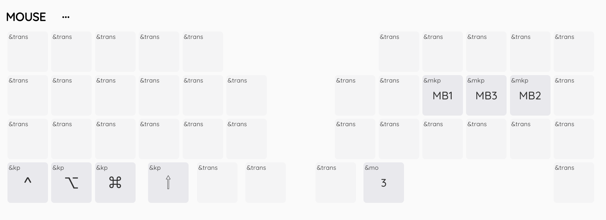
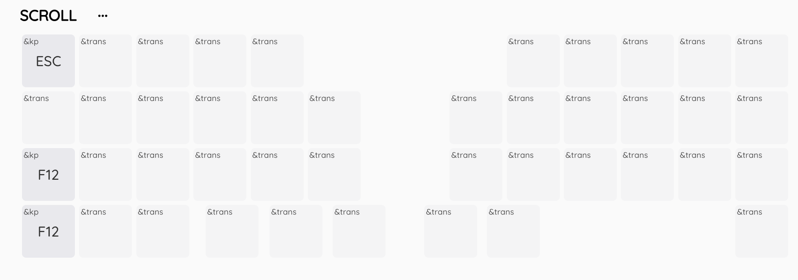
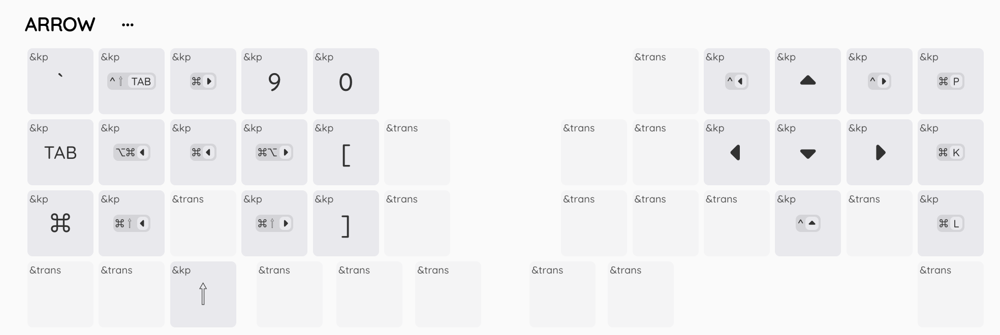
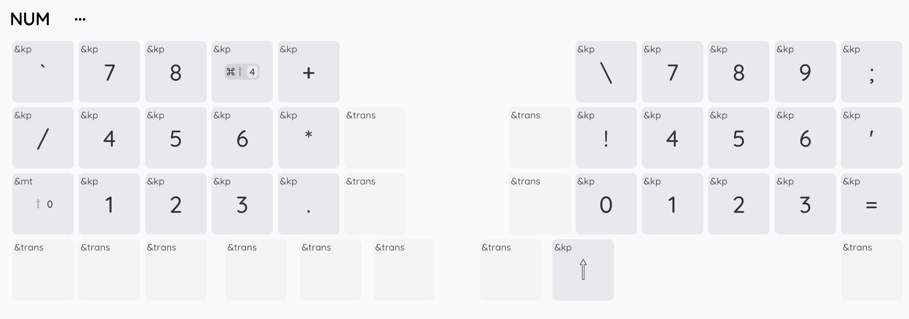
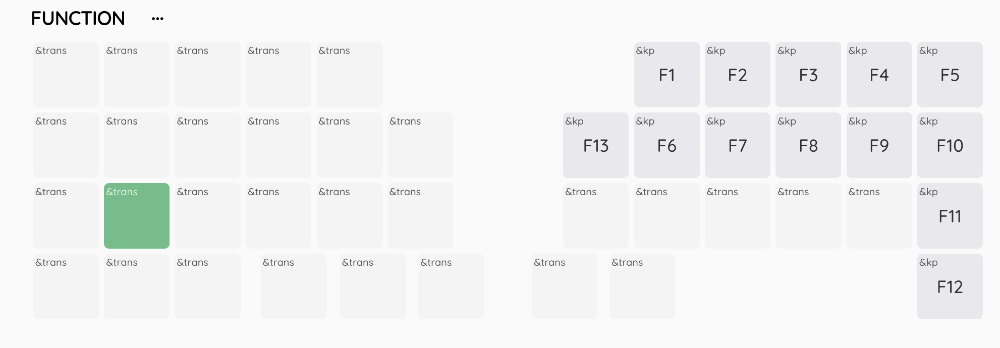
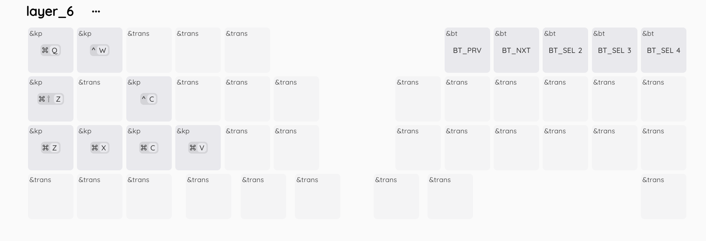

## description

- このキーボードは無線分割式 19mm トラックボール内蔵のキーボードになります。
  

## スペック

- ファームウェア
  - ZMK を使用しています
  - ZMKStudio に対応しております
- ハードウェア
  - choc v1/v2、lofree 系列のスイッチが使用可能
  - 左手側が master,右手側が slave になります
  - 左手側に OLED 内蔵
  - トラックボールはケースごとマグネットで張り付いているので、脱着可能です
  - バッテリー対応 2つ必要です
    - 横 25mm,縦 35mm,厚さ 5mm 以内のものを使用してください
    - 製作者はこちらを使用しています(https://amzn.asia/d/ebvtzoP)
    - 250mAh で大体 1 週間は持ちます
    - リチウムイオンバッテリーは十分注意して取り扱ってください(https://www.baj.or.jp/battery/safety/safety16.html)

## oledの切り替えについて
- デフォルトではus配列のmacに適した配置になっております
- またoledもmacに併せてありますので、windowsの方は以下の設定をnに指定することで表示が切り替わります
- config/boards/shields/tomkey/tomkey_L.conf
- `CONFIG_ZMK_DONGLE_DISPLAY_MAC_MODIFIERS=n`にする

## キーマップについて
- ZMKstudio にて確認・編集を行なってください
  - https://zmk.studio/

- ZMK keymap-editor も使用できます
  - マクロ設定などを使いたい場合はこちらを使うとべんりです
  - https://nickcoutsos.github.io/keymap-editor
  - ご使用の時は本リポジトリをフォークしてお使いください
    - ※フォークしてマクロ等にパスワードなどを設定する際はリポジトリがpublicになってしまい情報漏洩につながりますのでご注意ください

### レイヤーマップ
- レイヤー 0 がデフォルトです
- レイヤー 1 がオートマウスレイヤーです
  - トラックボール操作中に切り替わるレイヤーです(400ms でレイヤー０に切り替わります)
- レイヤー 2 がスクロールレイヤーです

## その他
不明な点がある場合は下記アカウントにご連絡ください
https://x.com/tomcat09131
