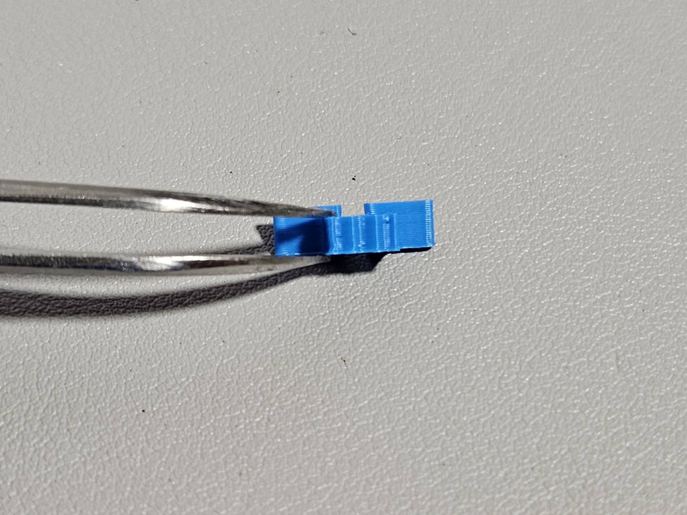
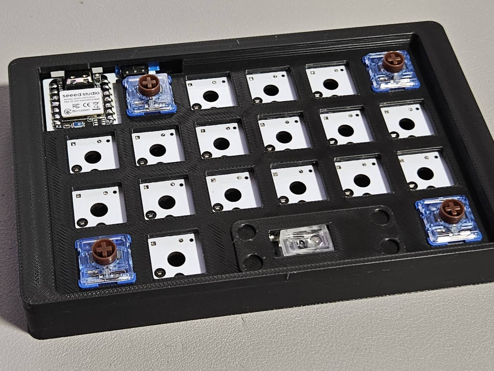
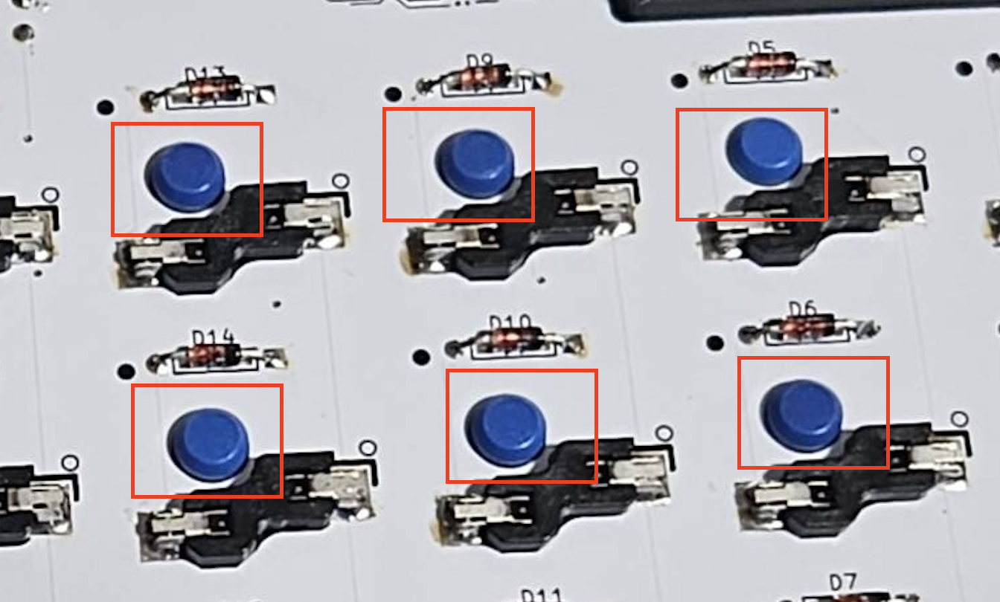
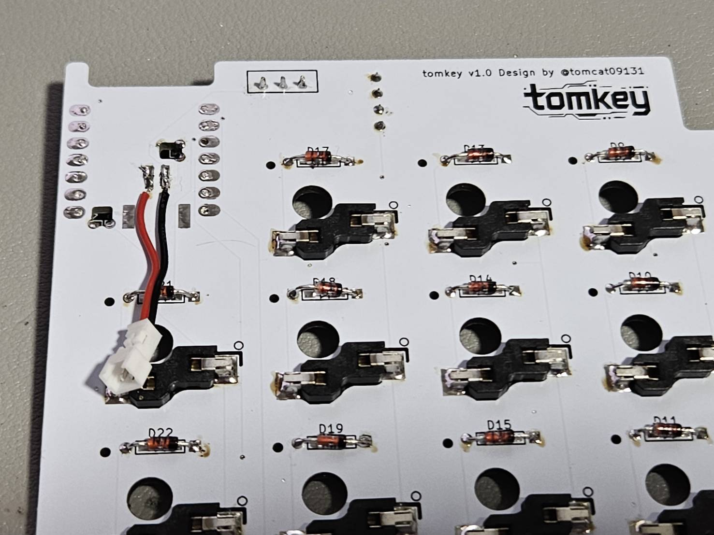
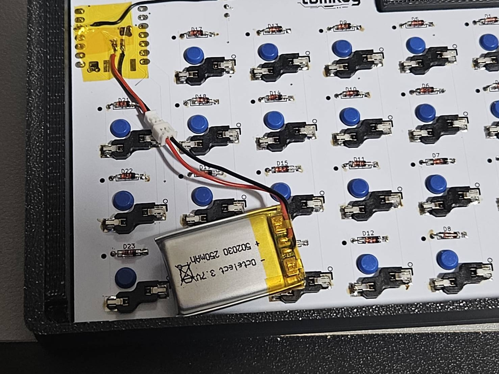

## マイコンカバーについて

- マイコンカバーは選択式のため、固定はしておりませんためそのままの状態だと外れることがあります
- 使用する場合は裏面に小さく両面テープなどをつけて固定しておつかください

## トラックボールセンサーについて

- トラックボールセンサーのレンズユニットが使っていると振動や摩耗などで浮いてくる場合があります。
- ウキがあるとトラックボールが正常に認識できませんので上から軽く押して止め直してください。必要に応じて接着剤などで固定をお願いします
  - 組み立て時点でウキがあるものは製作者側で接着固定している場合があります

## 電源スイッチカバーの取り付け

- 一応スイッチには上下で形状が異なります。通常の画像の向き(下側が平らで、上側が出っ張り)で取り付けます。もしスイッチが緩くてアソビが強い場合は上下逆にして取り付けてください
- 
- またスイッチは厚みがある方が左手側、薄い方が右手側のスイッチになります

## キースイッチの取り付け

- キースイッチを取り付ける際は、ケースを持ちながら基盤を後ろから支えて押し込んで挿入します
- 差し込みが甘いとキー入力ができませんので、しっかりと全部奥まで差し込まれていることを確認の上でご使用ください
- 差し込んでいるのにキースイッチが反応しない場合は、 スイッチのピンを曲げてしまっている可能性があるので取り付け直してください
- 最初に四隅から取り付けると安定して取り付けやすいです
- 
- 外す時はケース裏側から、スイッチのセンターを押し出すと簡単に外れます。硬い場合はピンセット裏側など固いもので押し込むとやりやすいです
- 

## バッテリーの接続

- マイコン部分の裏側にあらかじめ JST プラグ 1.25mm のメス端子を接続してありますので、裏面カバーを外してここにバッテリーを接続します
- 購入されるバッテリーによっては、+極と-極が逆に接続されている可能性があります。その状態で本体と接続しますとマイコンの破壊、バッテリーの発火の原因となりますので事前に確認を行なった上で取り付けをお願い致します
- tomkey では+極を赤色、GND を黒色で配線しております
- 基本的にご購入されたバッテリーは動作確認済品をおつけしております
  - 
  - 

## ファームウェアの焼き方

- マイコンの左上のリセットスイッチを細い棒などで 2 回連続押すと、PC で外部ストレージとして認識されます
- 完全組み立て品の場合は、リセットスイッチカバーの突起が出ているのでそれを 2 回押してください
  - 
- 本リポジトリをフォークしてもらって、keymapEditor やコードエディタで編集しフォークしたリポジトリに push 後、GithubAction が自動で走るので完了後にビルドされたファームを左右のマイコンにそれぞれドラッグ＆ドロップでコピーしてください
  - zip ファイルの中身はこちらになります
  - マイコン初期化:settings_reset-seeeduino_xiao_ble-zmk.uf2
  - 左:tomkey_L dongle_display-seeeduino_xiao_ble-zmk.uf2
  - 右:tomkey_R-seeeduino_xiao_ble-zmk.uf2
