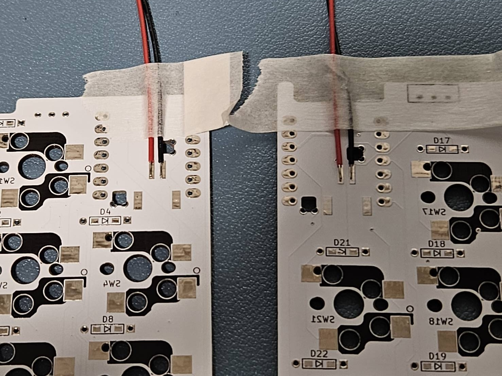
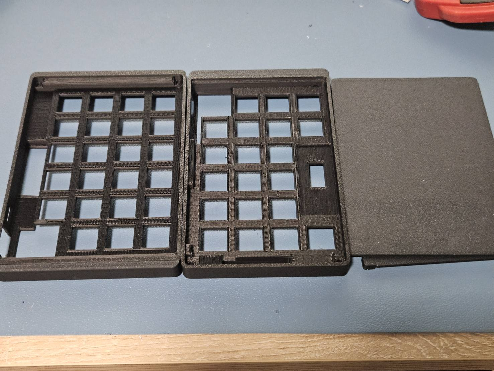
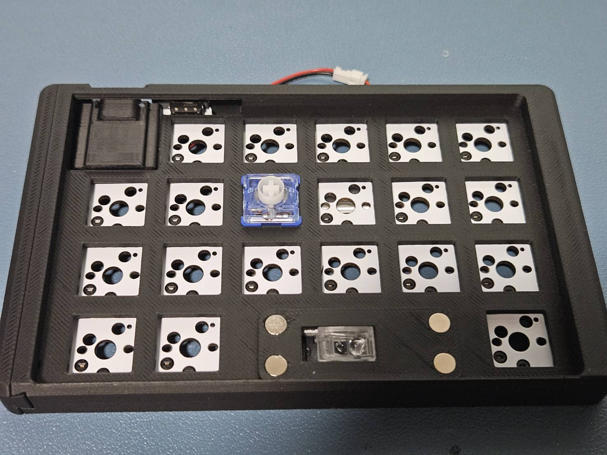
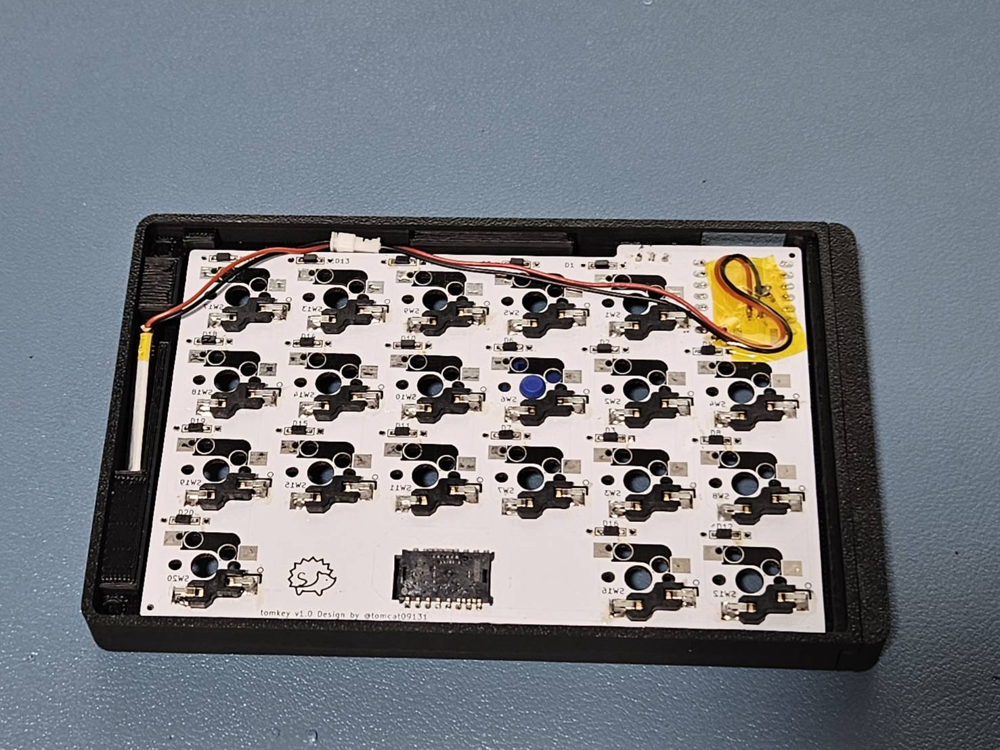
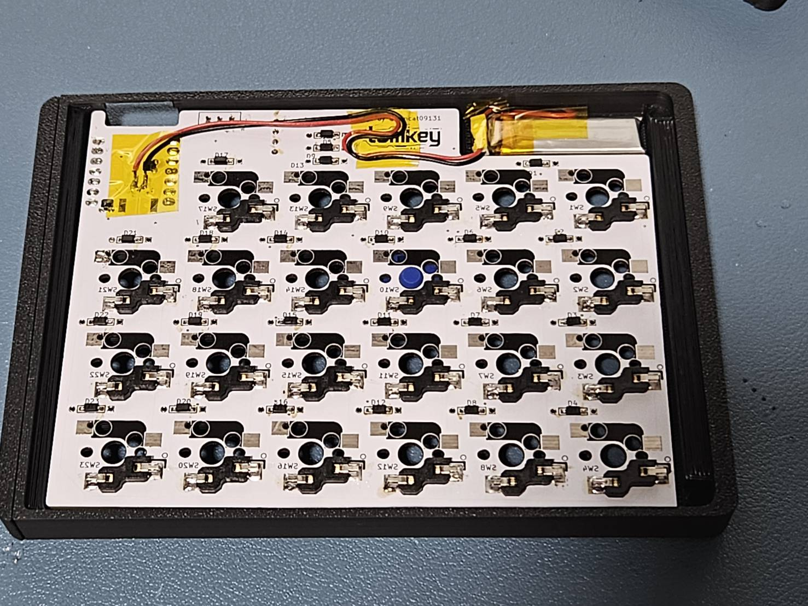
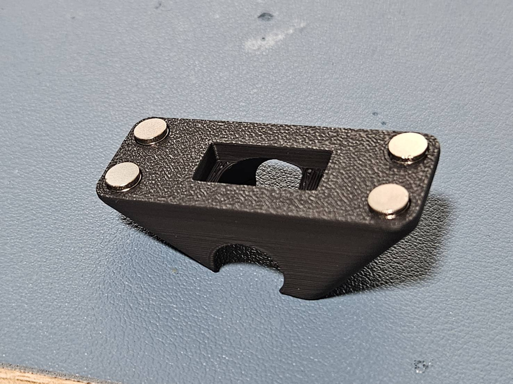
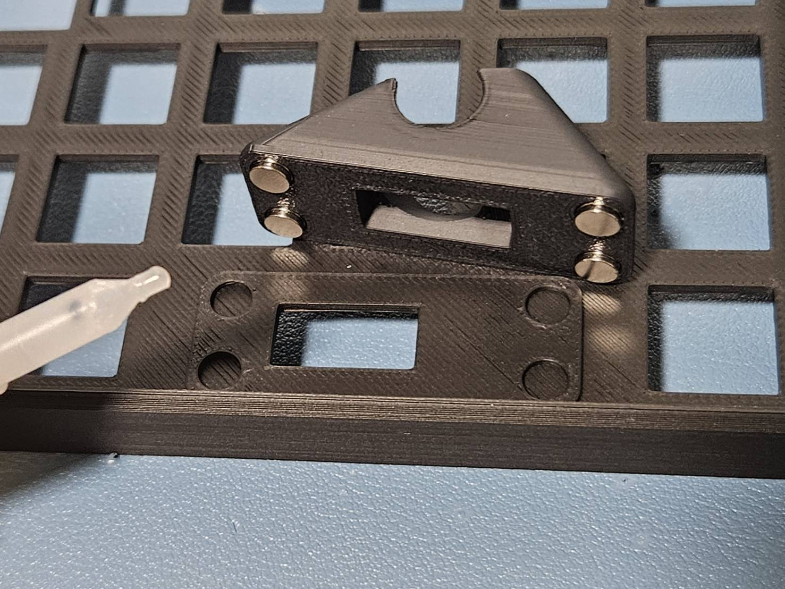
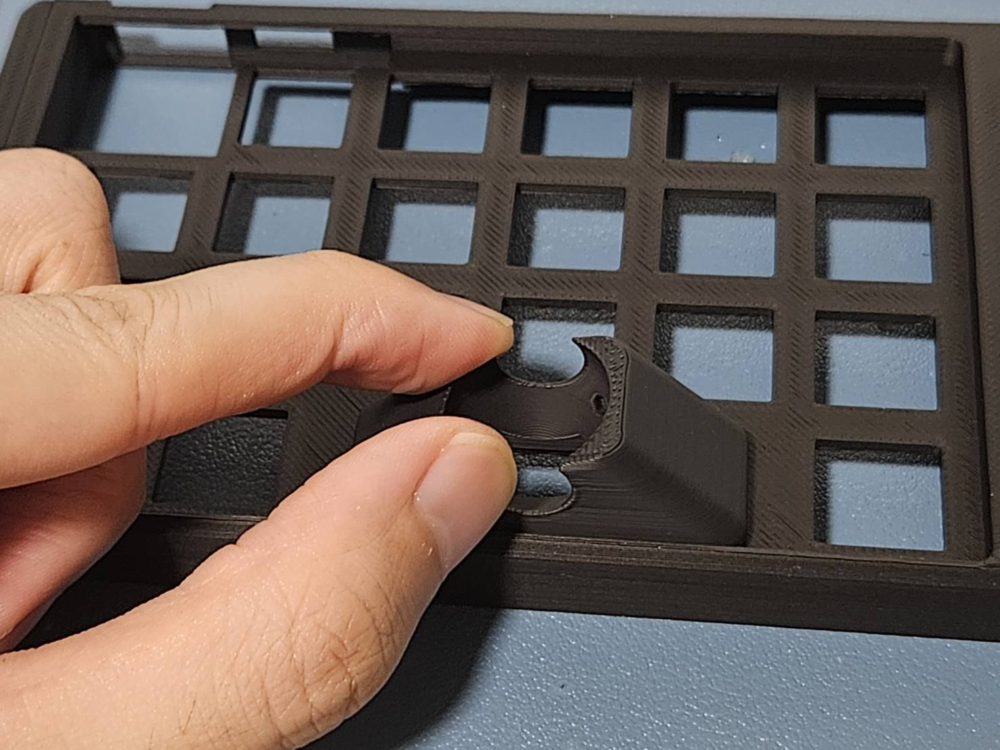
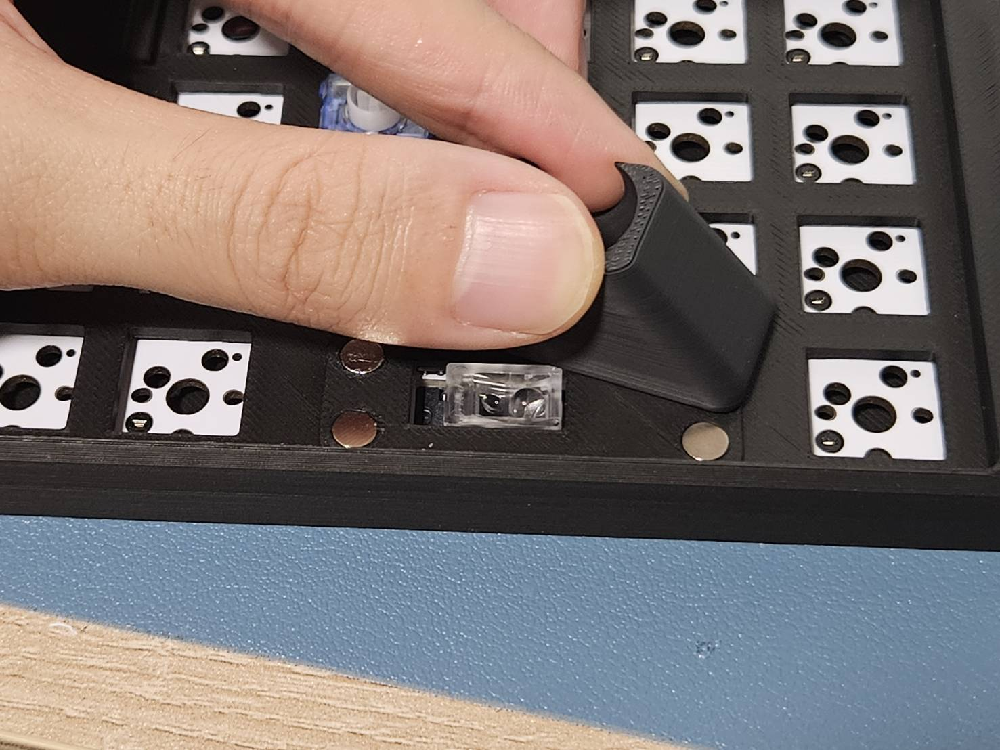

# tomkey → tomkeyLk への交換キットの交換手順

## 付属品

- tomkeyLk ケース左右一式
- 左右接続のための linker
- PH1.25 ケーブル メス x2
- 100mAh バッテリー x2
- 5mm マグネット 4 個 + 1 個（予備）

## 交換に必要な備品

- ハンダゴテ
- ハンダ
- 絶縁テープ（一応マスキングテープでも OK）
- 瞬間接着剤
- ピンセット（ハンダ作業時）

## 交換手順

予め、tomkey の方のスイッチやバッテリーなどを全て外し、ケースから外しておいた状態にしておいてください。

### PH1.25 ケーブルの取り付け

先に基板に長めの PH1.25 ケーブルを取り付けます

最初についているケーブルはハンダで温めて外します。素手で触ると危険なのでピンセットを使ってください。
取り外したら、新しい PH1.25 ケーブルを写真のようにマスキングで固定しながら取り付けます。
配線に色や向きに関しては写真を参考に注意して取り付けてください。

### ケースの取り付け

例として先に右側を説明します。

まず、tomkeyLk のケースから bottom ケースを外します

基板をケースに入れる前にスイッチカバーを取り付けます。スイッチカバーは既存のものを使用してください

スイッチカバーは向きがあり、全体が平らになっている方を底面方向に向けて取り付けます。（左右で微妙に厚さが異なるので注意ください）

取り付けたら基板を後ろから押さえながらキースイッチを取り付けてください。この時点で全てキースイッチを取り付けてしまっても OK です。

同様の要領で左側も行なっていきます。

### 配線の取り回し

ケースとキースイッチを取り付け終わったら、バッテリーを取り付けて配線を取り回します。
決められた位置にバッテリーを設置しないと裏蓋が閉まらないため写真を参考に作業を行ってください。
配線に関してはテープで止めても止めなくてもケースに収まりますが、PH1.25 同士の接続部のみは決めれれたスペースに収めてください

右手側
一番左の溝にバッテリー用のスペースがあるのでそこに格納します。PH1.25 同士の接続部は上側にスペースを設けているのでそこに設置します。

左手側
右上のスペースに格納します。PH1.25 同士の接続部もそこにまとめて格納するので、予めテープでバッテリーと端子部分をテープで固定すると楽です。

### トラックボールケース用マグネットの取り付け

まずは、トラックボールケースの底面にマグネットを４つ取り付けます。この時点ではまだ接着剤で固定しないでください

右手の４つの穴に瞬間接着剤を少量流して、トラックボールケースを４つの磁石を押し込むように差し込みます。
瞬間接着剤の量が多いと、穴から溢れてトラックボールケースが固定されてしまうので気をつけてください。

30 秒ほど押さえたらある程度接着できているはずですので、横にずらすようにしながらトラックボールケースを取り外します。

